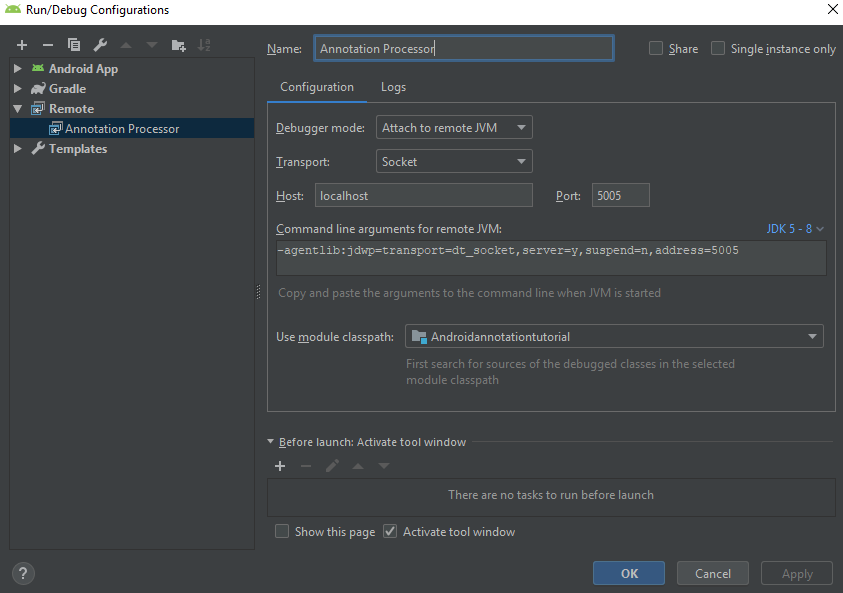
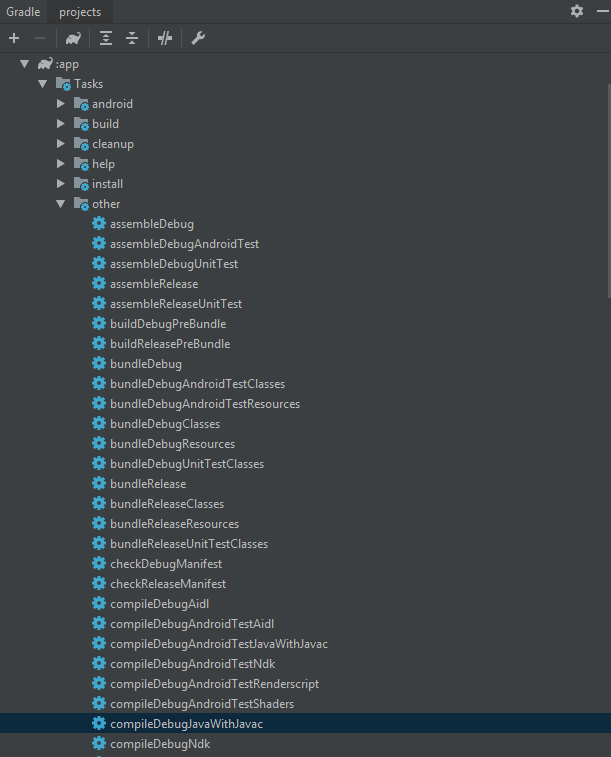

# Annotation processing tutorial - Android
Some great tutorial of annotation processing:
* [Android Annotation Processing Tutorial](https://blog.mindorks.com/android-annotation-processing-tutorial-part-1-a-practical-approach) by Janishar Aliand
* [ANNOTATION PROCESSING 101](http://hannesdorfmann.com/annotation-processing/annotationprocessing101) by Hannes Dorfmann
* [Annotation Processing Boilerplate Destruction (Square Waterloo 2014)](https://speakerdeck.com/jakewharton/annotation-processing-boilerplate-destruction-square-waterloo-2014) by Jake Wharton

## Motivitaion
Create a simple library similar to **Buffer Knife**.
* Use annotation `@BindView` to map an object to a `View`
* Use annotation `@OnClick` to map a method to a `View`'s `oonClickListener`
* Generate a `Binder` class to deal with the mapping
``` java
public class MainActivity extends AppCompatActivity {

    @BindView(R.id.tv_content)
    TextView tvContent;

    @Override
    protected void onCreate(Bundle savedInstanceState) {
        super.onCreate(savedInstanceState);
        setContentView(R.layout.activity_main);
        Binder.bind(this);
    }

    @OnClick(R.id.bt_left)
    public void click1(View v){
        tvContent.setText("Left button clicked");
    }

    @OnClick(R.id.bt_right)
    public void click2(View v){
        tvContent.setText("Right button clicked");
    }
}
```

## How does this work?
See the [Android Annotation Processing Tutorial](https://blog.mindorks.com/android-annotation-processing-tutorial-part-1-a-practical-approach)

## Basic
see the following tutorial
* [ANNOTATION PROCESSING 101](http://hannesdorfmann.com/annotation-processing/annotationprocessing101) by Hannes Dorfmann
* [Annotation Processing Boilerplate Destruction (Square Waterloo 2014)](https://speakerdeck.com/jakewharton/annotation-processing-boilerplate-destruction-square-waterloo-2014) by Jake Wharton


## Debug
In the `init()` method we've already retrive the reference to `Messager`, A `Messager` provides the way for an annotation processor to report error messages, warnings and other notices.
It's not a logger for you, even thought it can be used for that purpose. Messager is used to write messages to the third party developer who uses your annotation processor in their projects.

How to use `Messages` as logger?
Once you got the `Messager` reference, you could just call
``` java
messager.printMessage(Diagnostic.Kind.OTHER, "this is my note");
```
Once you successfully (re)build the project/module, you see the **Build** panel as:

Then click the button to see full building message:


## Debug with break points
Collected different ways to debug annotation processing with break points:
1. Create a remote configuration:
  1.1 Run-> Edit Configurations
  1.2 Add a Remote configuration. Here use the default port 5005, could be any port. In the *Use module classpath:*, select your project.
  
2. add following line in the `gradle.properties`:
```
org.gradle.daemon=true
org.gradle.jvmargs=-agentlib:jdwp=transport=dt_socket,server=y,suspend=n,address=5005
```
Be sure the `address=5005` uses the same port as in the step 1.
3. set up your break points.
4. in the `Gradle` panel, right click app -> Tasks -> other-> compileDebugJavaWithJavac, choose create

past the `-agentlib:jdwp=transport=dt_socket,server=y,suspend=n,address=5005` in the VM options:

5. Run the remote configuration, if succeed, you can see the following message in the Debug panel
```
Connected to the target VM, address: 'localhost:5005', transport: 'socket'
```
6. Run the `compileDebugJavaWithJavac` and waiting for break points.

Some other ways to debug with break points:
https://stackoverflow.com/a/36765029/6025731

If failed to go into break points, try `Invalidate Caches and restart` android studio
